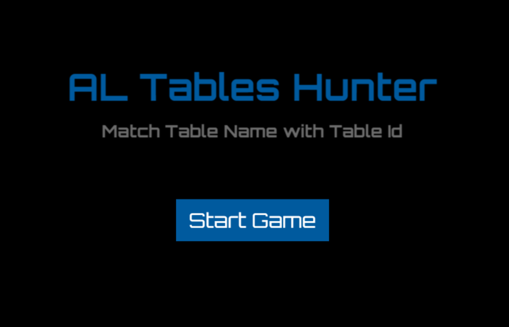
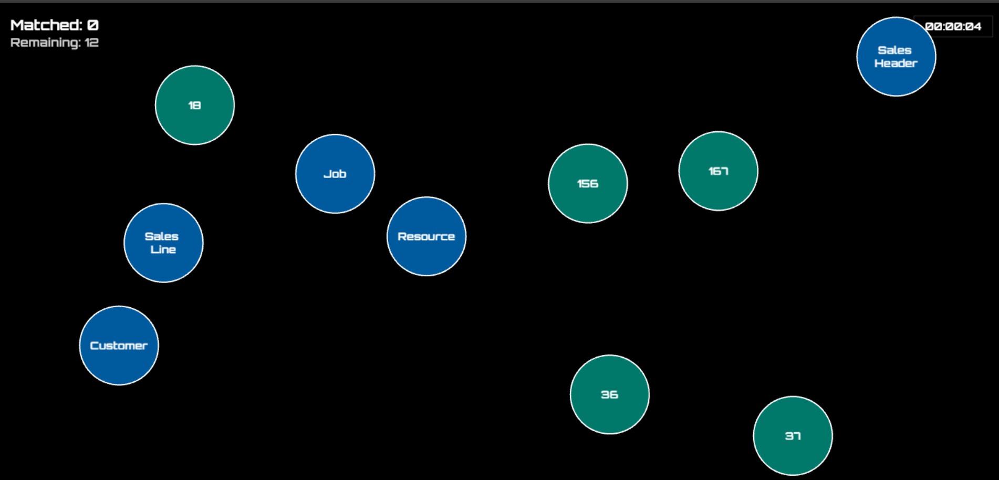

# 🎯 AL Objects Hunter

> **Are you ready to become a Business Central Master?** 🚀

Turn those boring BC table IDs into an **EPIC MEMORY GAME**! Chase down floating circles, match tables with their IDs, and prove you're the ultimate Dynamics 365 Business Central developer! 💪



## 🎮 Game On! How to Play

Welcome to the arena, developer! Your mission: **Hunt down and match those BC tables!** 🎪



### 🎯 Your Mission
Match the **Blue circles** (Table Names) with their **Red circles** (Table IDs) before time runs out! Every table is based on real Business Central data from `src/data/tables.json`.

### 🕹️ Controls (It's Super Easy!)
- **👆 Click/Tap** any circle to select it
  - Pick a **Blue one** → You'll see "Select the ID!"
  - Pick a **Red one** → You'll see "Select the Table Name!"
- **👆 Click** the matching partner to score! 
- **Changed your mind?** Click the same circle again to deselect
- **Pro tip**: You can't select two blues or two reds at once (we're not *that* evil 😉)

### 💰 Score Like a Boss!
Want to top the leaderboard? Here's how the magic happens:

- **🎁 Base Score**: 10 points for each correct match
- **⚡ Speed Demon Bonus**: 
  - Match in **under 1.5 seconds** → +10 bonus points! 🔥
  - Match in **under 3.0 seconds** → +5 bonus points! ⚡
- **🔥 Streak Multiplier** (THIS IS WHERE IT GETS CRAZY!):
  - **3 correct in a row** → 1.5× multiplier! 
  - **5 correct in a row** → 2.0× multiplier! 💥
  - Miss once? Streak resets to 0 (but no points lost, we're nice like that)

**🧮 Example:** Correct match (10) + Speed bonus (10) × Streak multiplier (2.0) = **40 POINTS!** 🎊

### 📊 Your Dashboard
Keep an eye on these stats:
- **Score** 💯 — How awesome you're doing (top-left)
- **Matched/Remaining** 🎯 — Tables conquered vs. tables left to hunt
- **Messages** 💬 — Real-time feedback (bottom of screen) like "MATCHED! 🎉" or "Oops, Wrong Match! 😅"

### 🏆 Pro Tips from the Champions
- **Speed is life!** Match under 1.5s for maximum points
- **Build that streak!** 5 in a row = 2× MULTIPLIER BABY! 🚀
- **Watch those circles bounce!** They won't wait for you
- **Stay focused!** One wrong match kills your precious streak 😱

### 🎪 Game Flow
- Circles spawn automatically throughout the game
- All tables from your data file will eventually appear
- Match them all to complete the game and see your FINAL SCORE! 🏅
- Can you beat your high score? Challenge accepted! 💪


## 🚀 Ready to Play? Let's GO!

**3 Simple Steps to Start Hunting:**

1.  **📦 Grab the Goods**:
    ```bash
    npm install
    ```

2.  **🔥 Fire Up the Game**:
    ```bash
    npm run dev
    ```

3.  **🎮 Open Your Browser** and go to `http://localhost:5173`

**BOOM!** You're in the game! 💥

## 🛠 Under the Hood (For the Curious Devs)

```
📁 bc-al-objects-hunter/
├── 🎬 src/scenes/         → Where the magic happens (Boot, Menu, Game)
├── ⚪ src/objects/         → Circle entities that bounce around
├── 🎯 src/services/        → Game logic & scoring wizardry
├── 📊 src/data/           → tables.json (Your BC knowledge base!)
└── ⚙️  src/config/         → Game configuration & settings
```

## 🎨 Want to Customize? Make It YOUR Game!

### 🆕 Adding More Tables (Expand Your Empire!)
Open `src/data/tables.json` and throw in some new challenges:

```json
{
  "name": "My Awesome Custom Table",
  "id": 50000,
  "category": "Custom Objects",
  "difficulty": 1
}
```
Save it, refresh, and BOOM! New hunting targets! 🎯

### 🚀 Level Up the Game (For the Ambitious!)
Want to make it even MORE epic? Here are some ideas:

- **🌟 Multiple Levels**: Create `Level2Scene.ts`, add boss battles, unlock achievements!
- **👥 Multiplayer Mode**: Take `ScoreService` to a Node.js backend, add WebSockets, and challenge your team!
- **🎵 Custom Music**: Swap out audio files and make it YOUR vibe
- **🏆 Leaderboards**: Connect to a database and track global high scores
- **🎪 Power-ups**: Slow-motion mode? Extra time? You decide!

**The world is your playground!** 🌍

## 👨‍💻 Built With Love Using

- **🎮 Phaser 3** — The game engine that makes magic happen
- **📘 TypeScript** — Because we like our code typed and tight
- **⚡ Vite** — Lightning-fast builds and hot reload

---

## 🎉 Ready to Hunt?

**Start the game, chase those circles, and show us what you've got!** 🏆

*Built with 💙 for the Business Central Developer Community*

**Happy Hunting! 🎯**
